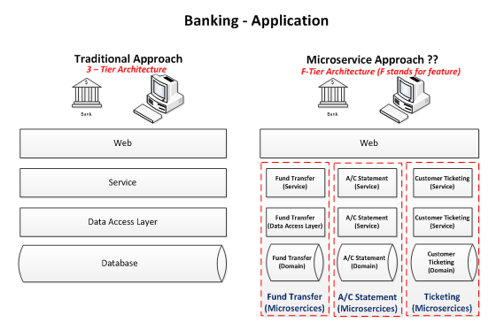

# Micro Service ile Online Banking

Bu projesi kapsamında  online bankacılık sisteminin backend servislerinin Micro Service mimarisi kullanılarak yapılması
amaçlanmaktadır. 

İlk olarak Micro Service mimari yapısı aşağıdaki gibidir. İlk olarak projeye başlamadan önce Micro Service yapısına biraz değinelim.

- API Gateway :  arka planda bir çok microservice bulunsa da clientın bakış açısından ortada tek bir uygulama vardır, Bundan dolayı client istekleri tek bir host kullanarak yapar. Bu istekleri microservicelerin önünde bulunan API Gateway yakalar ve her isteği ilgili microservice e yönlendirir.
- Identity Provider : Client için authentication ve authorization bilgilerini tutan, clientın login olması sonucunda clienta uygulamaya erişim için erişim tokeni veren ve microservislerin bu tokeni doğrulamasını sağlayan merkezi kimlik yönetimi uygulamasıdır.
- Management : Uygulamaları scale etmek gibi operasyonları yöneten araç.
- Service discovery : Mıcroservislerin ileetişim için birbirlerini otomatik olarak bulmasını sağlayan, bunu da her servisin ayağa kalkınca gelip discovery servisine register olması sonu yapabilen araç.

Bu proje kapsamında micro serviceler ile iletişim kurarken HTTP üzerinden Rest apilar kullanılarak iletişim sağlanacaktır.

Proje kapsamında beklenen minimum fonksiyonlar ve teknik ihtiyaçlar aşağıda listelenmiştir.

## Beklenen fonksiyonlar

* Müşteri yönetimi
* Hesap yönetimi
* Kart yönetimi
* Transfer yönetimi

### Müşteri yönetimi

Yaratılacak API'lar aracılığıyla; müşteri yaratma, güncelleme ve silme işlemleri mümkün olacaktır. Silme işlemi hesaplarında
parası bulunan yada kredi kartı borcu bulunan müşteriler için mümkün olmayacak.

### Hesap yönetimi

Banka müşterilerinin yatırımlarını kontrol etmek amacıyla kullanabilmeleri için hesap yaratmalarına, silmelerine API'lar
aracılığıyla izin verilecektir. Kullanıcılar iki farklı türde hesap açabilecek, vadesiz mevduat hesabı ve birikim hesabı.
İki hesap arası para transferi yapılabilecek, vadesiz mevduat hesabı başka hesaplara para transferi için kullanılabilecekken
birikim hesabından doğrudan para transferi yapılamayacak. Hesaplar TL, Euro yada Dolar para birimlerinde açılabilecek.

### Kart yönetimi

Müşterilere banka tarafından bankamatiklerde yada alışverişte kullanılmak üzere ön ödemeli banka kartı ve kredi kartları
sunulmaktadır. Bu kartların yaratılması, müşteri ve hesapla ilişkilendirilmesi, kart kullanarak para transferi (alışveriş) 
fonksiyonları API'lar aracılığıyla sağlanacaktır.

Ayrıca kredi kartları için; borç sorgulama, hesaptan borç ödeme, bankamatikten borç ödeme, ekstre görüntüleme (JSON formatında) 
işlemleri yine API aracılığı ile yapılabilecek.

### Transfer yönetimi

Müşterilerin para transferlerini yönetmek için uygun API'lar sağlanmalıdır. Bir müşteri farklı para birimlerinde açılan 
hesaplar arası transfer yapmak isterse güncel para kuru https://api.exchangeratesapi.io/latest?base=TRY API'dan 
alınmalı ve dönüşüm yapılıp transfer öyle gerçekleştirilmeli. Transfer işlemleri sadece IBAN üzerinden gerçekleştirilebilecek.

